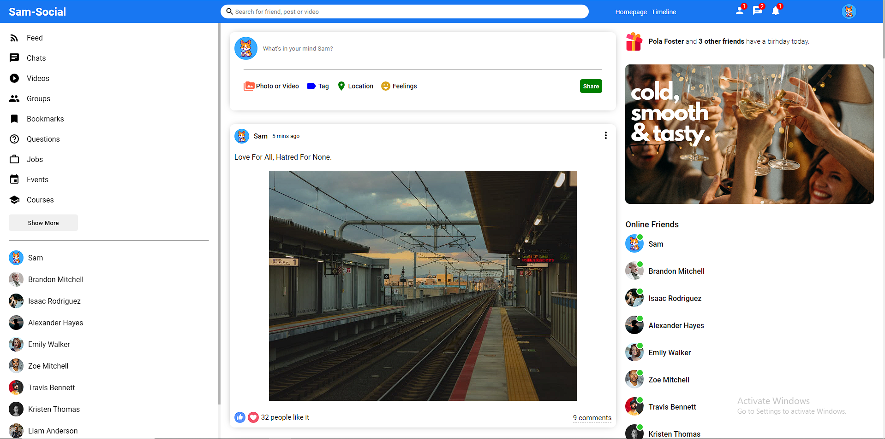
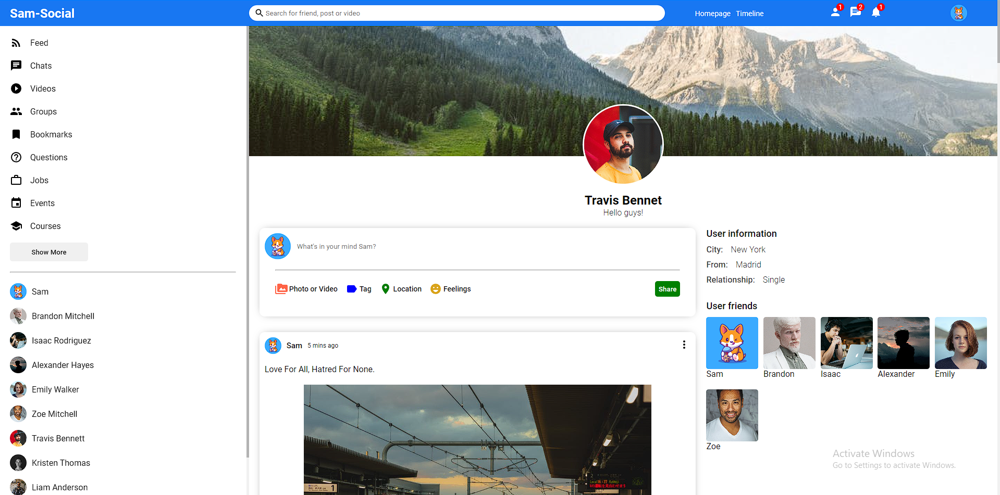
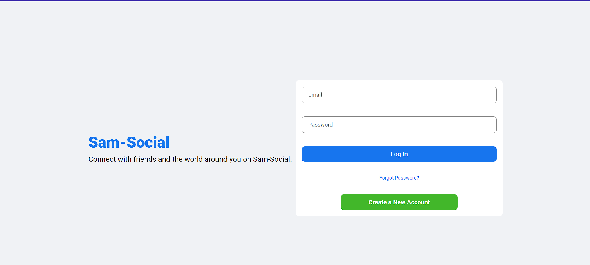
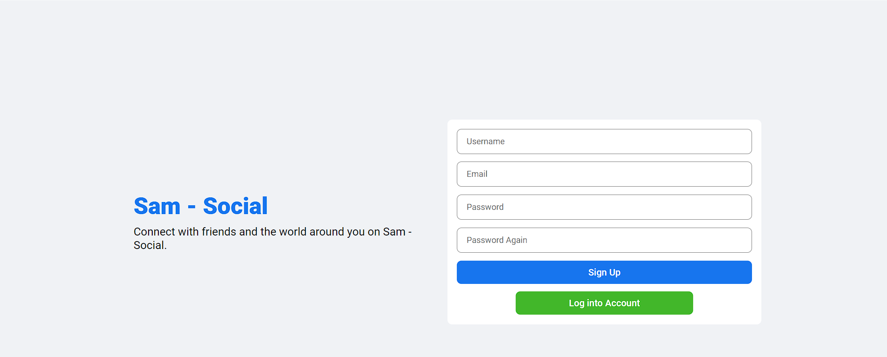

# Sam Social Media UI

## Description

Creating a social media UI with react. There's no function yet and just for the UI designs.

## UI Pages

- Home
- Profile
- Login
- Registration

## Tech Stacks Used:

- HTML
- CSS
- React.js

## Screenshots

- Home
  

- Profile
  

- Login
  

-Registration

